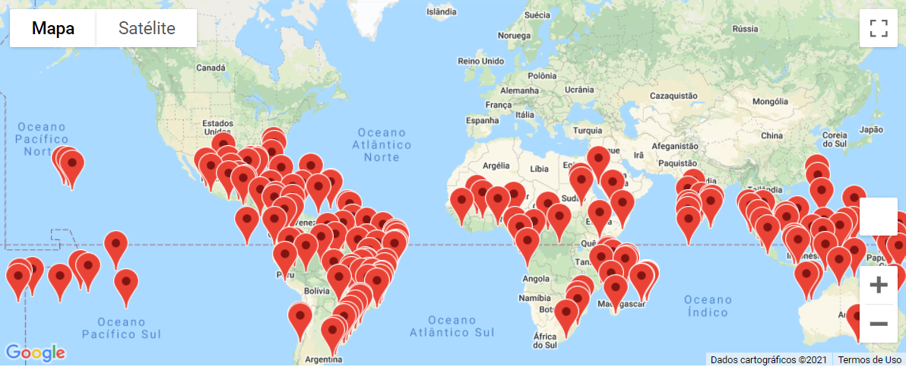
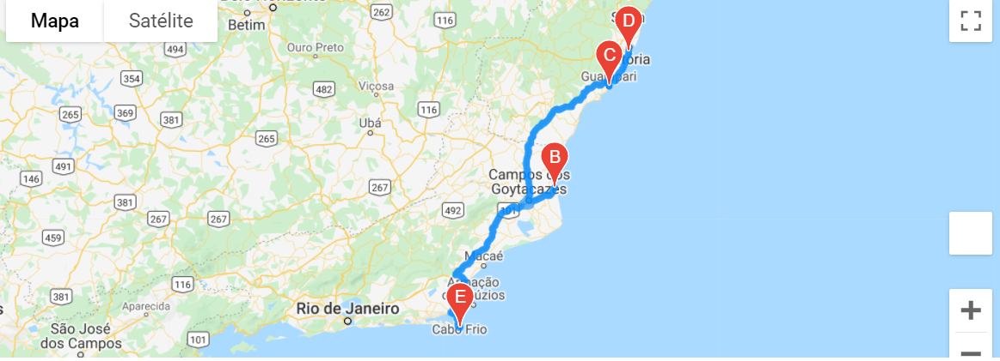
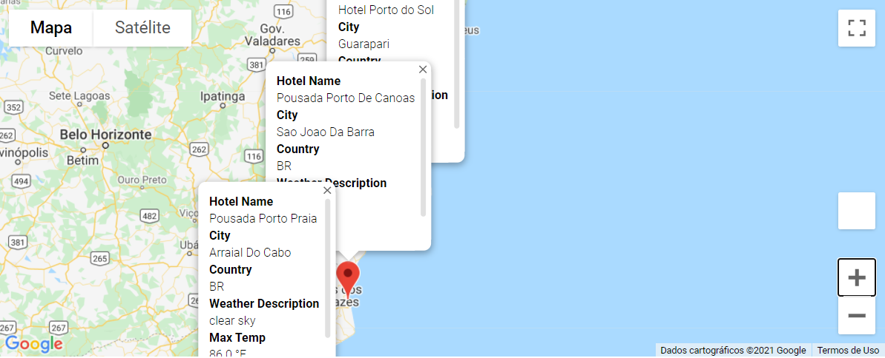

# World_Weather_Analysis

## Overview of World_Weather_Analysis
The purpose of this project is to provide suggestions for hotels based on clients' weather preferences (minimum and maximum temperatures). 

## Results:

### Weather_Database folder:
Starting with 2,000 random latitudes and longitudes, a csv file was created to present information for city, country, latitude, longitude, maximum temperature, percent of humidity, percent of cloudiness, wind speed and current weather description provided by OpenWeather API.

### Vacation_Search folder:
Based on the minimum and maximum temperatures provided by the customer, a csv file was generated to present information for city, country, maximum temperature, current weather description, latitude, longitude and hotel name. Utilizing the Google Maps API, a marker layer map was generated to display pop-up markers for each city on the map.

### Vacation_Itinerary folder:

Using the Google Directions API, a travel itinerary was created showing the route between four cities selected from the customer’s possible travel destinations. A marker layer map was created to exhibit a pop-up marker for each city on the itinerary as well as a information box describing the Hotel name, the name of the city, country, current weather description and maximum temperature.

